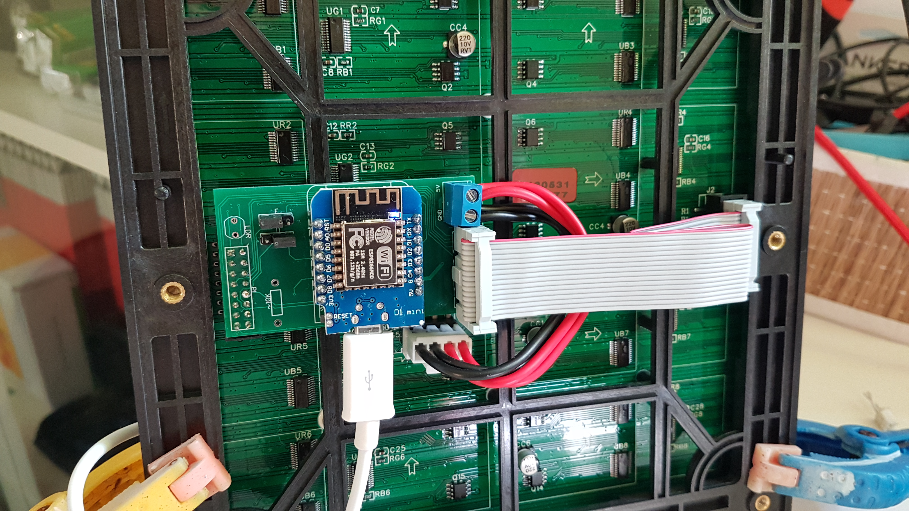
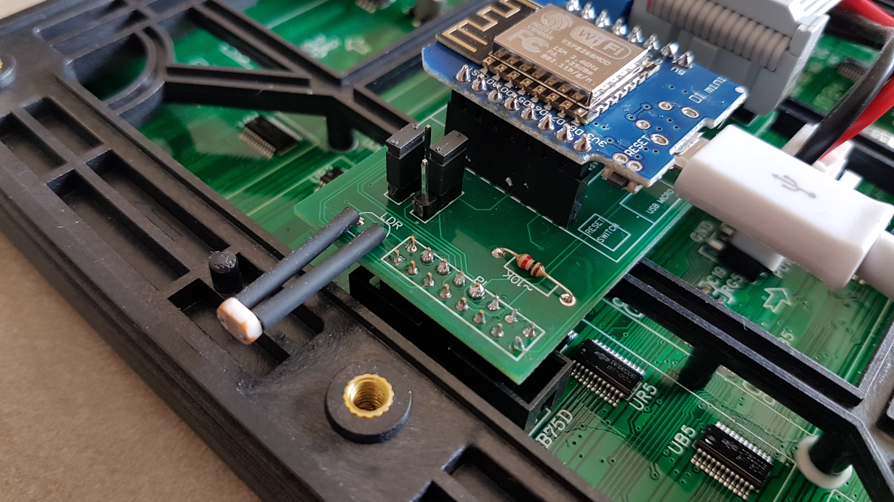
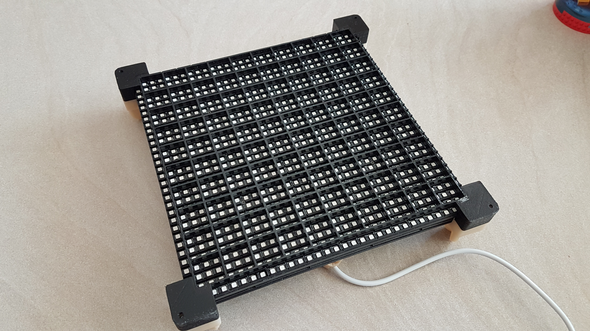
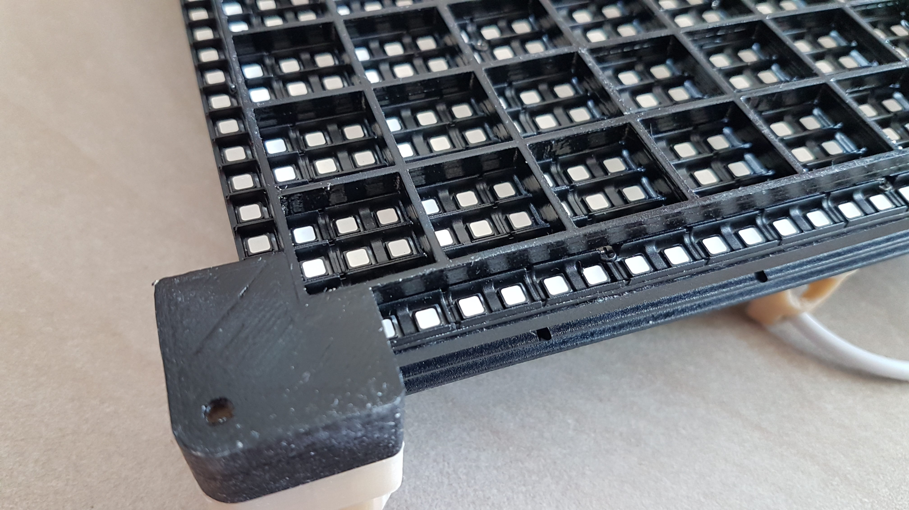
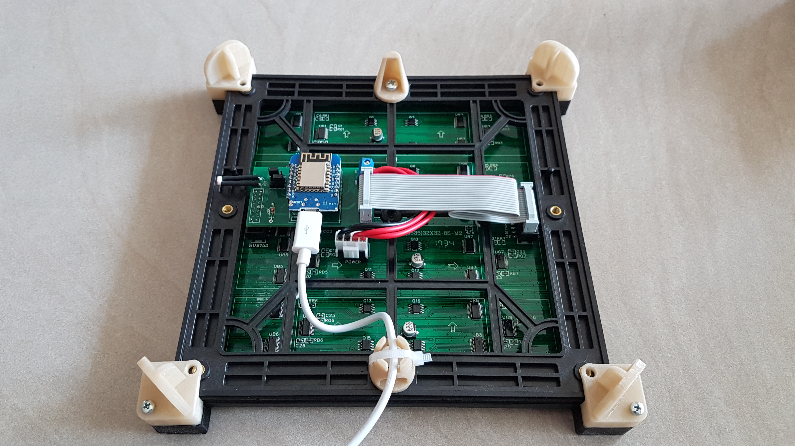

# Word Clock Hungarian
This is my implementation of the Word Clock in Hungarian. Rest of the document is in Hungarian, English of this [document is here](README_EN.md).

## Változások
1.0
- Egyes mudulok külön header fájlokba lettek szétszedve

0.9
- Kód első verziója, az alap funckiók működnek
- Fényerő szabályzás még nem működik

## Főbb funkciók
- 10x10 mátrixban elhelyezett magyar szavakkal mutatja az aktuális időt 5 perces pontossággal
- Az egyes szavak színe a napszaknak megfelelően, nappal fehér, este kékes, naplementekor piros, napfelkeltekor narancssárgás és között 1 órát átmenet
- A pontos időt NTP szerverről szedi, kézi beállítás nincs
- Minden egész perckor rövid animálás van, amikor 8-10 véletlenszerű betű felvillan véletlenszerű színnel
- MQTT szerverre minden percben küld egy státus üzenetet: RSSI, uptime percben és a érzékelt fényerő
- MQTTn keresztül figyel egy sleep topic-ra, ahova ha 1-es érkezik akkor lekapcsolja a kijelzőt

## Telepítés
- A kód Arudino IDE alatt kell elfordítani, ami ESP8266 alá be van konfigurálva
- Szükséges libraryk: PxMatrix LED MATRIX library by Dominic Buchstaller, Time by Michael Margolis (ezek megtalálhatók a Library Manager-ben), és persze az ESP alap libraryk, PubSubClient, stb.
### Projekt fájljai:
- WordClock_PxMatrix.ino: teljes programkód, ebben nem kell semmit módosítani ha ugyan ezt a kijelzőt használod és szintén magyar a kijelző
- settings.h: ebbe található a program beállításához szükséges össze paraméter
  - ANALOG_LOW: a legkisebb mért fény mennyiség (A0 analóg jel értéke)
  - BRIGHTNESS_LOW: a fenti érték esetén a kijező minimális fényereje
  - ANALOG_HIGH 120: a legnagyobb mért fény mennyiség (A0 analóg jel értéke)
  - BRIGHTNESS_HIGH: a fenti érték esetén a kijező maximális fényereje
  - ssid: wifi SSID
  - password: wifi jelszó
  - mqtt_server: MQTT szerver IPje, vagy maradjon üres ha nem kell
  - mqtt_user: MQTT usernév
  - mqtt_password: MQTT jelszó
  - clientID: MQTT klines ID
  - topicstatus: az MQTT topic amire az óra küldi percenként a státusz üzenetet
  - topicDebug: az MQTT topic amire a debug üzenetek mennek
  - topicSleep: az MQTT topic amire várja a sleep üzentetet
  - STATUS_UPDATE_INTERVAL: státusz MQTT üzenet gyakoriság másodpercben
  - ANIMATION_WORD_COUNT: minden percben a rövid animációban kigyújtütt betűk száma
  - ANIMATION_WORD_DELAY: az animációban az egyes betűk közötti késletetés miliszekundumban
- NTP.h fájl 63 sorától pár beállítás
  - GMTOffset: időzóna percben CET esetén ez 60
  - sm_latitude, sm_longtitude: földrajzi szélesség és hosszúság a napfelkelte, napnyugta számításhoz
- Arduino Board Configuration amit én használtam: LOLIN(WEMOS) D1 R2 mini, 4MB Flash size

## PCB
Minden részletesebb leírás nélkül egyelőre itt az általam használt PCB: https://www.pcbway.com/project/shareproject/PxMatrix_ESP8266_Driver.html
img könyvtárban van egy kép hogy néz ki. Ennek a leírása kicsit hosszú inkább mesélek róla a Youtube videóban.

## Hardver
- 32x32 pixeles, 192x192 mm P6 matrix kijelző: https://www.aliexpress.com/item/32658820147.html
- Wemos D1 mini klón: ebay, aliexpress, banggood, én már nem emlékszem az enyém honnan van
- 0.1 inch-es tűsor és csatlakozó 
- jumperek
- 0.2 inch-es csavaros 2 pólusú csatlakozó
- fotóellenállás

A PI és PO csatlakozóhoz nem vettem szabványos dugót és ajzatot, hanem sima egy soros tűsort és csatlakozót használtam, kéttőt egymás mellett és tökéletesen működik. Sőt a PO és a tápcsatlakozó olyan közel van egymáshoz hogy ott nem és férne el rendes ajzat. Viszont cserébe figyelni kell hogy dugja be az ember a dolgokat. Ahogy a képen is látszik a kijelzőn nyák lapján lévő nyilacskák balról jobbra mutassanak, és a PO csatlakozóba a szalagkábelt úgy kell bedugni hogy a csatlakozó oldalán a kiugrás a ESP felé legyen.

A nyákon a táp csatlakozó 5V és GND vezetéke össze van kötve a ESP 5V és GND lábával, így lehet a kijelzőt az ESPn keresztül microUSB csatlakozón keresztül hajtani, vagy más tápellátás esetén azt is a tápcsatlakozóra kötni és akkor azt ad áramot az ESPnek. Az én programom esetén ahol egyszerre sosem világít túl sok LED, USB tápról lehet a kijelzőt hajtani.
A P6-os matrix kijelző esetén a jumpereket a fenti képen látható módon kell elhelyezni.
Ez a Word Clock mivel egy időben az összes LEDnek csak viszonylag csak a kis része világít, átlagosan 250-300 mA-t fogyaszt. Így szerintem egy rendes 1A-es USB töltőről működtethető, nincs szükség külön 5V-os tápegységre.

## Fényerő szabályzás

A nyákon van hely egy fotoellenállás számára. Én itt nem vágtam le a fotoellenállás lábát, tettem rá zsugorcsövet és kihajlítottam hogy oldalt méreje a fényerőt. Ha jól emlékszem olyan LDR-t vettem ami 5K max megvilágítás mellett. Ehhez egy 5K-s ellenállást forrasztottam az ellenállás helyére (ahol a nyákon 10K felirat szerepel):

Így a max fényerő amit a ESP mér az olyan 400 körül van, de ahhoz hogy megállapítsam a háttérfényerősséget bőven elég. A beállításokban van 4 érték ami meghatározza hogy minimális analóg jel esetén mi legyen a kijelző fényereje és ugyan ez maximum esetén. Ezzel lehet játszani. Kettő között pedig arányosan alakul a fényerő mértéke.

## 3D nyomtatott alkatrészek és előlap
Az összes forrás és gcode fájl a 3D könyvtárban található. Teljes modell az alábbi részekből áll:
- 10x10 raster: ez a kijelzőt lefedő rács ami a 3x3 pixeles szavak megvilágító dobozokat előálltja
- 4 corners: ez jön a kijelző 4 sarkára. Ezt külön nyomtattam mert egyben nem fért volna bele a 3D nyomtató korlátaiba. Mind a 4 elem kicsit más, mindegyik a megfelelő sarokba kerüljön különben nem tökéletesen illeszkedik
- Lower corners: ez fogja meg a rácsot a másik oldalról, illetve eltartja a kijelzőt mondjuk a faltól hogy az elektronika elférjen
- Hanger support: egy kis kúp alakú elem amivel fel lehet akasztani egy szögre
- Cable holder: szintén egy kúpos elem amivel a kábelt lehet a falnál tartani, illetve hogy ne az USB csatlakozót húzza a kábel súlya

Itt látható az előlap a raszterrel és a 4 sarok elemmel amik pillanat ragasztóval vannak összeragasztva:

Kicsit közelebbről a sarok és hogyan illeszkedik a kijelző mélyedéseibe:

És a hátlap elemei:

Az én órám esetén a számlap 1.5 mm vastag szénacél lemez, amiből a betűk lézervágással lettek kivágva. A lemezt 150-es csiszolópapírral kézzel csiszoltam és utána lakkal befújtam hogy ne rozsdásodjon. A lemez és a raszter háló közé pedig pausz papír került hogy ne látszanak a LED-ek. A design alkönyvtárban van egy dxf, dwg meg pdf terv is. Ezeket a fájlokat küldtem egy egy CNC cégnek és ez alapján vágták ki nekem az előlapot.
