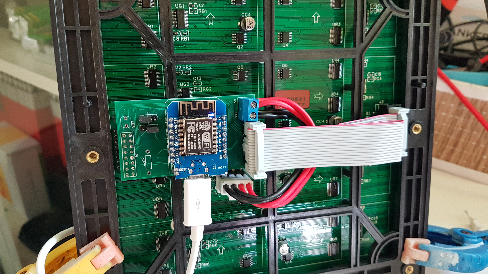

# Word Clock Hungarian
This is my implementation of the Word Clock in Hungarian. I post a long Youtube video on this project if you are interested. Even though I did this project in Hungarian, the code can be easliy adapted to any language. And as long as you can also fit in a 10x10 matrix, it is even easier.

## Change Log
1.0
- Settings and other parameters moved to separate files
- Brigthness control of the display

0.9
- First version of the code, main features included
- Brightness control missing

## Main features
- Display the current time by ligthing better in a 10x10 matrix which spell out the correct time. Every 5 minutes increment in Hungarian.
- The colour of the letters follows the time of the day, it is blue overnight, orange in dawn, white during the day, red at sunset. There is a 1 hour transition for each phased and the colour transition from one to another.
- Time is synced from NTP server, there is no manual setting.
- There is a small animation every minute, where 8-10 letters are light randomly in a random color.
- Status message is sent over MQTT which includes the RSSI, uptime and the brightness value.
- Device subscribes to a sleep topic in MQTT and if 1 is received, the screen is turned off ("quiet" mode overnight).

## Installing
- This is an Arduino IDE sketch, the IDE needs to be configured for ESP8266.
- Required libraries: PxMatrix LED MATRIX library by Dominic Buchstaller, Time by Michael Margolis (all can be found in the Library Manager), and basic ESP libraries like HTTP, PubSubClient for MQTT stb.
### Project files:
- WordClock_PxMatrix.ino: full source code. If the project is re-implemented for another language, some changes may be required here. More on that in the video.
- settings.h: contains all paramters and program settings
  - ANALOG_LOW: lowest A0 analogue value, which corresponds to darkness
  - BRIGHTNESS_LOW: brightness value of the display fo the lowest ANALOG_LOW value
  - ANALOG_HIGH 120: highest A0 analogue value, which corresponds to brightess condition
  - BRIGHTNESS_HIGH: brightness value of the display fo the lowest ANALOG_HIGH value
  - ssid: wifi SSID
  - password: wifi password
  - mqtt_server: MQTT server IP, leave empty to disable MQTT
  - mqtt_user: MQTT user name
  - mqtt_password: MQTT password
  - clientID: MQTT client ID
  - topicstatus: MQTT topic to which the status messages will be sent to
  - topicDebug: MQTT topic to which the debug messages will be sent to
  - topicSleep: MQTT sleep topic the device subscribes to
  - STATUS_UPDATE_INTERVAL: interval of the status messages in seconds
  - ANIMATION_WORD_COUNT: number of letters in the animation every minute
  - ANIMATION_WORD_DELAY: delay between each letter in the animation, in miliseconds
- NTP.h: NTP code and there are a few settings from line 63
  - GMTOffset: offset from GMT in minutes. For CET it should be set to 60.
  - sm_latitude, sm_longtitude: Your latitude and longtitude for the sunrise, sunset calculation
- Arduino Board Configuration: LOLIN(WEMOS) D1 R2 mini, 4MB Flash size

## PCB
This the PCB I designed for this project, and what you see in the pictures below: https://www.pcbway.com/project/shareproject/PxMatrix_ESP8266_Driver.html
More details in the video.

## Hardware
- 32x32 pixel, 192x192 mm P6 matrix display: https://www.aliexpress.com/item/32658820147.html
- Wemos D1 mini clone: ebay, aliexpress, banggood, I purchased mine a long time ago
- 0.1 inch male and female pin header 
- jumpers
- 0.2 inch pich terminal block
- LDR

I did not use the proper keyed 2x5 headers for the PI and PO connectors, I simply used two single pin headers next to each other. And the board works fine, just pay attention how it gets plugged in. In fact the PO header and the power terminal block is so close to each other that a proper male header does not fit. Check how it is plugged in as shown on the picture below. Pay attention to the arrows on the matrix PCB, it should be pointing up and right. The ribbon cable should have the key facing the ESP.

The PCB contains a 5V and GND power connection which is the terminal block. Those terminals are connected to the 5V and GND pins of the ESP. The display gets the power from the terminal blocks where the provided power cable plugs to. The setup can either be powered from the micro USB of the ESP, or in case of a separate 5V power supply, it should be connected terminal blocks. In both cases ESP and the display will receive power. Even though these displays can draw multiple amps when all pixels are light, in this case the usual consumption is around 150-300 mA. I am powering mine from a decent 1A USB wall charger to have some margin.

## Fényerő szabályzás

A nyákon van hely egy fotoellenállás számára. Én itt nem vágtam le a fotoellenállás lábát, tettem rá zsugorcsövet és kihajlítottam hogy oldalt méreje a fényerőt. Ha jól emlékszem olyan LDR-t vettem ami 5K max megvilágítás mellett. Ehhez egy 5K-s ellenállást forrasztottam az ellenállás helyére (ahol a nyákon 10K felirat szerepel):

Így a max fényerő amit a ESP mér az olyan 400 körül van, de ahhoz hogy megállapítsam a háttérfényerősséget bőven elég. A beállításokban van 4 érték ami meghatározza hogy minimális analóg jel esetén mi legyen a kijelző fényereje és ugyan ez maximum esetén. Ezzel lehet játszani. Kettő között pedig arányosan alakul a fényerő mértéke.

## 3D nyomtatott alkatrészek és előlap
Az összes forrás és gcode fájl a 3D könyvtárban található. Teljes modell az alábbi részekből áll:
- 10x10 raster: ez a kijelzőt lefedő rács ami a 3x3 pixeles szavak megvilágító dobozokat előálltja
- 4 corners: ez jön a kijelző 4 sarkára. Ezt külön nyomtattam mert egyben nem fért volna bele a 3D nyomtató korlátaiba. Mind a 4 elem kicsit más, mindegyik a megfelelő sarokba kerüljön különben nem tökéletesen illeszkedik
- Lower corners: ez fogja meg a rácsot a másik oldalról, illetve eltartja a kijelzőt mondjuk a faltól hogy az elektronika elférjen
- Hanger support: egy kis kúp alakú elem amivel fel lehet akasztani egy szögre
- Cable holder: szintén egy kúpos elem amivel a kábelt lehet a falnál tartani, illetve hogy ne az USB csatlakozót húzza a kábel súlya

Itt látható az előlap a raszterrel és a 4 sarok elemmel amik pillanat ragasztóval vannak összeragasztva:

Kicsit közelebbről a sarok és hogyan illeszkedik a kijelző mélyedéseibe:

És a hátlap elemei:

Az én órám esetén a számlap 1.5 mm vastag szénacél lemez, amiből a betűk lézervágással lettek kivágva. A lemezt 150-es csiszolópapírral kézzel csiszoltam és utána lakkal befújtam hogy ne rozsdásodjon. A lemez és a raszter háló közé pedig pausz papír került hogy ne látszanak a LED-ek. A design alkönyvtárban van egy dxf, dwg meg pdf terv is. Ezeket a fájlokat küldtem egy egy CNC cégnek és ez alapján vágták ki nekem az előlapot.
